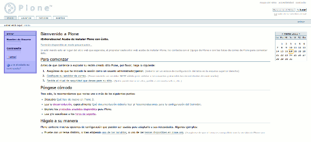
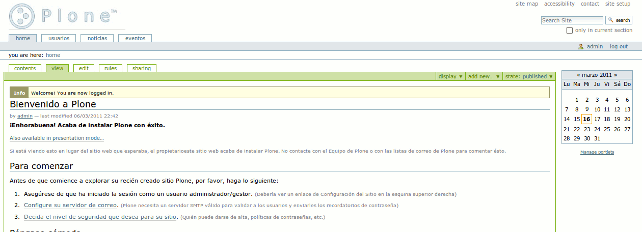
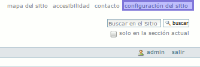
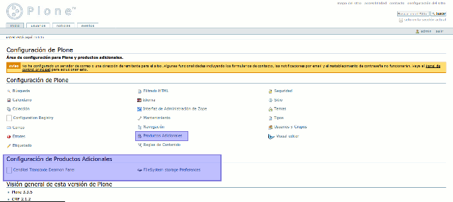
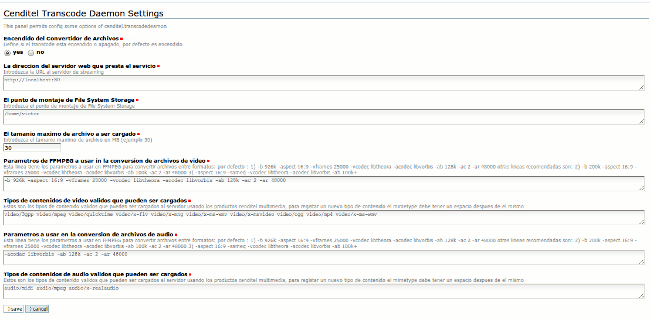

.. highlight:: rest

.. _ManualdeConfiguracion:

Manual de Configuración:
------------------------

Iniciando la Instancia:
"""""""""""""""""""""""

Para iniciar la instancia de su sitio Plone, usted debe proceder a continuación a iniciar la instancia del mismo:

.. code-block:: console

    (python2.4)$ ./bin/instance fg

Una vez creado su sitio Plone mediante el uso de archivos de configuracion buildout,
usted podrá acceder a él mediante la siguiente dirección en su navegador web favorito (Todos digan conmigo, Firefox!!!).
`http://localhost:8080/demo <http://localhost:8080/demo>`_

A continuación verá una página web como la que se muestra a continuación.

En la parte izquierda verá un ventana de identificación, por defecto tras instalar
el nombre de usuario para el sitio será admin y la contraseña admin. Luego de llenar las casillas, haga clic en log in y verá la siguiente pantalla.

En la parte superior izquierda busque el boton que dice site setup, que se puede ver en la siguiente imagen.

Esto lo trasladará a la pantalla general de configuración del sitio Plone.

En la parte inferior, se puede observar que existen dos paneles de uno de ellos
se obtendra información que es de importancia para nosotros al momento de configurar
nuestra instancia. En la parte superior de la imagen, se muestra otro enlace, que dice Productos Adicionales,
en este panel podremos ver el resultado del uso del recipe Plonesite y los perfiles de instalación que este disparó
durante la ejecución del script buildout.

Veamos primero el panel de productos adicionales.

Productos adicionales:
^^^^^^^^^^^^^^^^^^^^^^

Como se puede observar en la imagen siguiente, los productos correspondientes a los tipos de contenido de audio y vídeo,
el programa demonio encargado de la transcodificación y el tema específico utilizado por el reproductor html5 se encuentran ya instalados en el sitio Plone.

.. image:: _static/products.png

Ahora volvamos al menu superior y hagamos clic en el panel de control del menu inferior que dice Cenditel Transcode Deamon Panel.

Paneles de configuración de los productos:
^^^^^^^^^^^^^^^^^^^^^^^^^^^^^^^^^^^^^^^^^^

Cenditel Transcode Deamon Panel:
================================

Como se puede observar en la imagen anterior, el panel consta de distintos elementos de configuración. A continuación
vamos a mencionar cada uno de ellos:

* Encendido del Convertidor de Archivos: Esta opción indica si el convertidor de archivos se encuentra activado, y por defecto se encuentra en encendido. Al estar apagado, un validador se encarga de controlar que los usuarios solo puedan cargar archivos de tipo de contenido correspondientes a formatos de audio y vídeo libres. Entiendase vídeo vorbis theora ó audio vorbis con extensiónes ogg.
* Dirección del Servidor Web que presta el servicio: En este caso, se hace referencia al servidor web que presta el servicio de streaming. Por defecto se encuentra configurado en http://localhost:80, puede ser cambiado por un dominio local o de internet. 
* Punto de Montaje de File System Storage: Corresponde al directorio donde File System Storage coloca los archivos del sitio. En este caso, este valor corresponde al nivel de directorios superior del cuarto parametro, de la variable storage, en la parte fss del archivo 05-mediafilestorage.cfg de buildout o en otras palabras dado el caso particular al directorio donde se encuentra el archivo buildout.cfg. 
* Tamaño máximo de archivo a ser cargado: Especifica el tamaño máximo para archivos de audio o vídeo que pueden ser cargados. Por defecto, 30 MegaBytes
* Parametros de FFMPEG a usar en la conversión de archivos de vídeo: Para mayor información visite `documentación oficial de ffmpeg <http://www.ffmpeg.org/ffmpeg.html#SEC3>`_

* Tipos de contenidos de video validos que pueden ser cargados: Corresponde a la salida del comando file -i "Archivo.old" de sistemas Unix. Si el resultado del archivo no corresponde con alguno de los siguientes, el archivo no es codificado como archivo de vídeo e incluso no puede ser subido al servidor. Estos son los admitidos por defecto:

    * video/3gpp: Información en `Alegsa <http://www.alegsa.com.ar/Dic/3gp.php>`_
    * video/mpeg : Información en `Alegsa  <http://www.alegsa.com.ar/Dic/mpeg.php>`_
    * video/quicktime Información en `Alegsa <http://www.alegsa.com.ar/Dic/quicktime.php>`_
    * video/x-flv Información en `Alegsa <http://www.alegsa.com.ar/Dic/flv.php>`_
    * video/x-mng Información en `wikipedia <http://es.wikipedia.org/wiki/Multiple-image_Network_Graphics>`_, soporte por remover.
    * video/x-ms-wmv Información en `wikipedia <http://es.wikipedia.org/wiki/Windows_Media_Video>`_
    * video/x-msvideo Información en `Alegsa <http://www.alegsa.com.ar/Dic/avi.php>`_
    * video/ogg Información en `Alegsa http://www.alegsa.com.ar/Dic/ogg.php>`_
    * video/mp4 Información en `Alegsa http://www.alegsa.com.ar/Dic/mp4.php>`_

* Parametros de FFMPEG a usar en la conversión de archivos de audio: Para mayor información visite `documentación oficial de ffmpeg <http://www.ffmpeg.org/ffmpeg.html#SEC3>`_
* Tipos de contenidos de audio validos que pueden ser cargados: Corresponde a la salida del comando file -i "Archivo.old" de sistemas Unix. Si el resultado del archivo no corresponde con alguno de los siguientes, el archivo no es codificado como archivo de audio e incluso no puede ser subido al servidor. Estos son los admitidos por defecto:

    * audio/midi: Información en `Alegsa <http://www.alegsa.com.ar/Notas/58.php>`_
    * audio/mpeg: Información en `Alegsa <http://www.alegsa.com.ar/Dic/mp3.php>`_
    * audio/x-realaudio: Información en `wikipedia <http://en.wikipedia.org/wiki/RealAudio>`_

