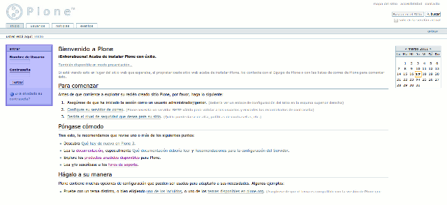
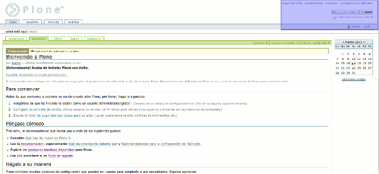
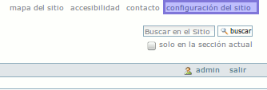
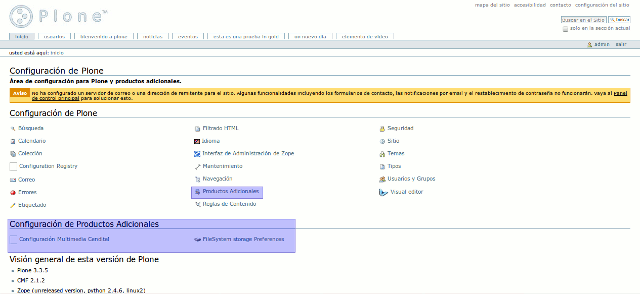
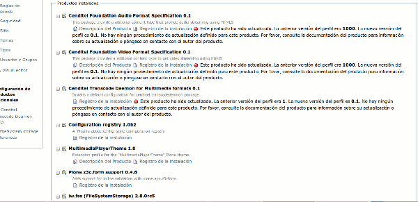
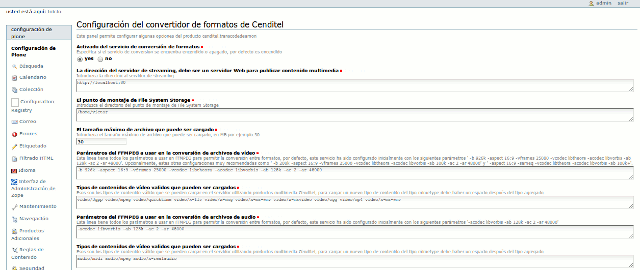
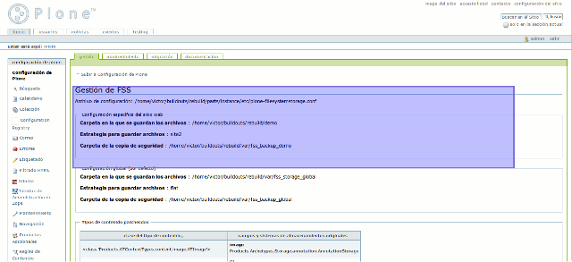

.. highlight:: rest

.. _manual_de_configuracion:

=============
Configuración
=============

Iniciando la Instancia en Plone 3.3.5
=====================================

Para poder visualizar su sitio Plone, usted debe proceder a iniciar la instancia del mismo:

.. code-block:: console

    (python2.4)$ ./bin/instance fg

Una vez creado su sitio Plone mediante el uso de archivos de configuración buildout,
usted podrá acceder a él mediante la siguiente dirección en su navegador web favorito
(Todos digan conmigo, Firefox!!!) `http://localhost:8080/demo <http://localhost:8080/demo>`_.

A continuación verá una página web como la que se muestra a continuación.

En la parte izquierda verá un ventana de identificación, por defecto tras instalar
el nombre de usuario para el sitio será ``admin`` y la contraseña ``admin``. Luego de llenar
las casillas, haga clic en log in y verá la siguiente pantalla.

En la parte superior izquierda busque el botón que dice site setup, que se puede ver
en la siguiente imagen.

Esto lo trasladará a la pantalla general de configuración del sitio Plone.

En la parte inferior, se puede observar que existen dos paneles de uno de ellos
se obtendrá información que es de importancia para nosotros al momento de configurar
nuestra instancia. En la parte superior de la imagen, se muestra otro enlace, que dice
Productos Adicionales, en este panel podremos ver el resultado del uso del recipe
Plonesite y los perfiles de instalación que este disparó durante la ejecución del
script buildout.

Veamos primero el panel de productos adicionales.

Productos adicionales
=====================

Como se puede observar en la imagen siguiente, los productos correspondientes a los
tipos de contenido de audio y vídeo, el programa demonio encargado de la recodificación
y el tema específico utilizado por el reproductor html5 se encuentran ya instalados
en el sitio Plone.

Ahora vuelva al menú superior y haga clic en el panel de control del menú inferior
que dice Configuración Multimedia Cenditel.

Paneles de configuración de los productos
-----------------------------------------

Cenditel Transcode Deamon Panel
^^^^^^^^^^^^^^^^^^^^^^^^^^^^^^^

Como se puede observar en la imagen anterior, el panel consta de distintos elementos
de configuración. A continuación vamos a mencionar cada uno de ellos:

* Encendido del Convertidor de Archivos: Esta opción indica si el convertidor de archivos se encuentra activado, y por defecto se encuentra en encendido. Al estar apagado, un validador se encarga de controlar que los usuarios solo puedan cargar archivos de tipo de contenido correspondientes a formatos de audio y vídeo libres. Entiéndase vídeo vorbis theora o audio vorbis con extensión ogg.

* Dirección del Servidor Web que presta el servicio: En este caso, se hace referencia al servidor web que presta el servicio de streaming. Por defecto se encuentra configurado en http://localhost:80, puede ser cambiado por un dominio local o de Internet. 

* Punto de Montaje de File System Storage: Corresponde al directorio donde File System Storage coloca los archivos del sitio. En este caso, este valor corresponde al nivel de directorios superior del cuarto parámetro, de la variable storage, en la parte fss del archivo 05-mediafilestorage.cfg de buildout o en otras palabras dado el caso particular al directorio donde se encuentra el archivo buildout.cfg. En este campo, evite dejar espacios en blanco.

* Tamaño máximo de archivo a ser cargado: Especifica el tamaño máximo para archivos de audio o vídeo que pueden ser cargados. Por defecto, 30 MegaBytes

* Parámetros de FFMPEG a usar en la conversión de archivos de vídeo: Para mayor información visite `documentación oficial de ffmpeg <http://www.ffmpeg.org/ffmpeg.html#SEC3>`_

* Tipos de contenidos de vídeo validos que pueden ser cargados: Corresponde a la salida del comando file -i "Archivo.old" de sistemas Unix. Si el resultado del archivo no corresponde con alguno de los siguientes, el archivo no es codificado como archivo de vídeo e incluso no puede ser subido al servidor. Estos son los admitidos por defecto:

    * video/3gpp: Información de `video/3gpp en Alegsa <http://www.alegsa.com.ar/Dic/3gp.php>`_.

    * video/mpeg: Información de `video/mpeg en Alegsa  <http://www.alegsa.com.ar/Dic/mpeg.php>`_.

    * video/quicktime: Información de `video/quicktime en Alegsa <http://www.alegsa.com.ar/Dic/quicktime.php>`_.

    * video/x-flv: Información de `video/x-flv en Alegsa <http://www.alegsa.com.ar/Dic/flv.php>`_.

    * video/x-mng: Información en `wikipedia <https://es.wikipedia.org/wiki/Multiple-image_Network_Graphics>`_, soporte por remover.

    * video/x-ms-wmv: Información de `video/x-ms-wmv en wikipedia <https://es.wikipedia.org/wiki/Windows_Media_Video>`_.

    * video/x-msvideo: Información de `video/x-msvideo en Alegsa <http://www.alegsa.com.ar/Dic/avi.php>`_.

    * video/ogg: Información de `video/ogg en Alegsa <http://www.alegsa.com.ar/Dic/ogg.php>`_.

    * video/mp4: Información de `video/mp4 en Alegsa <http://www.alegsa.com.ar/Dic/mp4.php>`_.

* Parámetros de FFMPEG a usar en la conversión de archivos de audio: Para mayor información visite `documentación oficial de ffmpeg <http://www.ffmpeg.org/ffmpeg.html#SEC3>`_

* Tipos de contenidos de audio validos que pueden ser cargados: Corresponde a la salida del comando file -i "Archivo.old" de sistemas Unix. Si el resultado del archivo no corresponde con alguno de los siguientes, el archivo no es codificado como archivo de audio e incluso no puede ser subido al servidor. Estos son los admitidos por defecto:

    * audio/midi: Información de `audio/midi en Alegsa <http://www.alegsa.com.ar/Notas/58.php>`_

    * audio/mpeg: Información de `audio/mpeg en Alegsa <http://www.alegsa.com.ar/Dic/mp3.php>`_

    * audio/x-realaudio: Información de `audio/x-realaudio en wikipedia <https://en.wikipedia.org/wiki/RealAudio>`_

    * application/octec-stream: Referente a algunos archivos mp3 de baja calidad.

Como se mencionó anteriormente, para llenar el campo del punto de montaje de File System Storage es necesario tener cierta información,
veamos entonces el otro panel correspondiente a ``FileSystem Storage Preferences``.

File System Storage Preferences
^^^^^^^^^^^^^^^^^^^^^^^^^^^^^^^

Como se puede observar en la imagen, el campo ``Carpeta donde se guardan los archivos`` corresponde a un directorio dependiente del directorio donde
se encuentra el script buildout, el siguiente punto corresponde a la estrategia de almacenamiento que tiene el valor ``site2`` del cual se puede obtener más
información en la `página oficial de FSS <http://ingeniweb.sourceforge.net/Products/FileSystemStorage/>`_

A continuación veamos el archivo de salida generado para el servidor nginx durante la ejecución de buildout.
Este archivo, contiene la configuración necesaria para permitir el acceso a nuestros vídeos en un directorio demo.
Usando la normativa location de nginx que apunta a nuestro directorio buildout y que debe coincidir con el directorio donde esta
apuntando la configuración de File System Storage. 

En este caso:

.. code-block:: console

    $ gedit etc/nginx/sites-enabled/demo

Abrirá el siguiente archivo:

.. code-block:: console

    server {
            # DNS/IP y Puerto en que escucha la aplicación
            listen   * :80;

            # Nombre del servidor
            server_name  192.168.12.215;

            # Tamaña máximo de subida de archivos
            client_max_body_size 24M;

            # Tamaña máximo de buffer de archivos
            client_body_buffer_size 128K;
    
            # Archivo de registro de acceso del sitio web
            access_log  /var/log/nginx/demo.access.log;
    
            # Archivo de registro de error del sitio web
            error_log  /var/log/nginx/demo.error.log error;
    
            # Interfaz Administrativa de Zope
            location /manage {
                    proxy_pass       http://192.168.12.215:8080/VirtualHostBase/
                    http/192.168.12.215:80/manage_main/VirtualHostRoot/;
                    
                    proxy_set_header Host $host;
            }
    
            # Sitio Proyecto Canaima 
            location / {
                    proxy_pass       http://192.168.12.215:8080/VirtualHostBase/
                    http/192.168.12.215:80/demo/VirtualHostRoot/;
                    
                    proxy_set_header Host $host;
            }
    
            # Sitio de publicación de archivos para Streaming
            location /demo {
                    root /home/victor/buildouts/cenditelmultimedia;
                    autoindex on;
            }
    
            # redirect server error pages to the static page /50x.html
            #
            error_page   500 502 503 504  /50x.html;
            location = /50x.html {
                    root   /var/www/nginx-default;
            }
    
    }

Para habilitar la carpeta, sencillamente se necesita realizar un enlace simbólico
desde ``etc/nginx/sites-enabled/demo`` a ``/etc/nginx/sites-enabled`` de la
siguiente manera.

.. code-block:: console

     # ln -s etc/nginx/sites-enabled/demo /etc/nginx/sites-enabled

Configuración de permisos
=========================

Se recomienda dar una configuración de permisos que permita la lectura y escritura
de archivos en la carpeta que prestará el servicio de streaming a través de nginx.
Por tanto, para la carpeta ``/home/usuario/buildout/directory/demo`` debe permitir
la lectura, escritura y ejecución por parte del dueño y la lectura por parte de
cualquier otro. Para lo cual se recomienda aplicar el siguiente comando:

.. code-block:: console

     $ chmod -R 755 /home/usuario/buildout/directory/demo

Para asignar los siguientes permisos:

* Dueño: Lectura, Escritura, Ejecución.

* Grupo: Lectura y Ejecución.

* Otros: Lectura y Ejecución.

De lo contrario, las solicitudes realizadas al servidor nginx devolverán un error
de acceso denegado a nivel de log en ``/var/log/nginx/error.log``.

Una vez realizadas las configuraciones, se puede proceder a agregar contenido de ejemplo.
