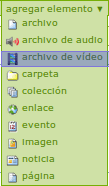

.. highlight:: rest

.. _ManualUso:

===========
Guía de Uso
===========

Para agregar contenido en su sitio Plone, vuelva a la página principal
`http://localhost:8080/demo <http://localhost:8080/demo>`_.

Como se puede ver en la imagen anterior, al hacer clic en el botón agregar elemento se despliega una
serie opciones de tipos de contenido que pueden ser agregados, pero para este sitio demostrativo y el presente manual,
solo dos son de interés.

Archivos de Audio
=================

A continuación se observa una serie de pasos para agregar tipos de contenido "Archivos de Audio":

* Uno: desplace su mouse hasta el elemento que se señala en la imagen:

    .. image:: ../_static/add_audio.png

* Dos: haga clic en él, e inmediatamente será enviado a la siguiente pantalla.

    .. image:: ../_static/fields_audio.png

Allí debe llenar un total de tres campos, de los cuales dos son obligatorios:

    * Campo Titulo: El campo es obligatorio.
    * Campo Descripción: El campo es opcional, pero se recomienda su llenado con una breve descripción del contenido.
    * Campo Audio: Este es el campo donde será cargado el archivo. Aplican ciertas restricciones que se presentan a continuación:
        * Tamaño máximo de archivo: El administrador del sitio configura un tamaño máximo en Megabytes para los archivos que pueden ser subidos al servidor, en caso de que el archivo sea demasiado grande el usuario será advertido de esto, mediante un mensaje como el que sigue:
            .. image:: ../_static/audio_file_to_big.png
        * Tipo de archivo cargado: El administrador define los tipos de archivos que pueden ser subidos al servidor, en caso de que el archivo cargado no coincida con ninguna de las restricciones el usuario verá un mensaje como el que se presenta a continuación:
            .. image:: ../_static/not_valid_audio_file.png
        * Estado del convertidor de archivos: En este caso, si el administrador desactiva el convertidor de archivos se activa una restricción para los tipos de contenidos que pueden ser cargados.

Archivos de Vídeo
=================

