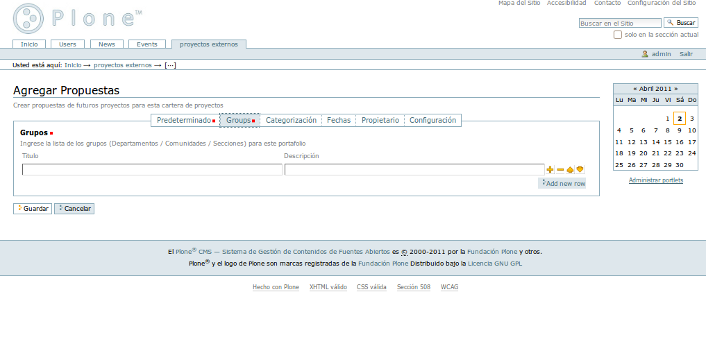

.. highlight:: rest

.. _uso:

===========
Guía de Uso
===========

Para agregar contenido en su sitio Plone, vuelva a la página principal
`http://localhost:8080/demo <http://localhost:8080/demo>`_.

.. image:: ../_static/agregar_carpeta.png

Como se puede ver en la imagen anterior, al hacer clic en el botón agregar elemento se despliega una
serie opciones de tipos de contenido que pueden ser agregados, para agregar una cartera de proyectos
hacemos Clic en Portafolio de Proyectos.

El cual lleva a otra  pantalla para llenar los suguientes campos:

Así queda la vista de Portafolio de Proyectos una vez creado

Una vez creado un Portafolio de Proyectos nos da la opcion de agregar Propuestas y Proyectos
ahora vamos a agregar una Propuesta, nos dirigimos a agregar elemento y hacemos Clic en Propuestas

Nos llevara a la siguiente pantalla donde llenaremos los siguientes campos

