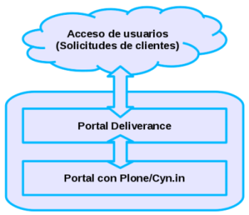

.. highlight:: rest

.. _ServiciosArquitectura:

Arquitectura
------------

La aplicación de comunidades de Cenditel esta compuesta de 3 diferentes aplicaciones --

* Cyn.in, es un Herramienta de gestión de conocimiento colaborativo 
  Software Libre - Administración de contenidos Web.

* Aplicación Deliverance como Proxy inverso - Es usado para presentar 
  una interfaz unificada para Cyn.in y cualquier otra potencial sistema 
  de información web que se pueda integrar a esa plataforma - y también 
  para el nivel de aplicación de temas y apariencias.

